# CODE_MAP — AgentHub 后端代码地图

> 由 `python scripts/gen_codegraph.py` 自动生成，请勿手改。
> 规模：83 模块 / 130 类 / 306 函数 / 646 边。

## 一、5 层洋葱模块全景（Mermaid）

> 边 = 模块间 IMPORTS（静态精确）。依赖方向应为 L5→L4→L3→L2←L1。

```mermaid
graph TD
    app_api_deps[app.api.deps] --> app_application_services[app.application.services]
    app_api_deps[app.api.deps] --> app_core_events[app.core.events]
    app_api_deps[app.api.deps] --> app_domain_llm[app.domain.llm]
    app_api_deps[app.api.deps] --> app_infrastructure_cache[app.infrastructure.cache]
    app_api_deps[app.api.deps] --> app_infrastructure_db[app.infrastructure.db]
    app_api_deps[app.api.deps] --> app_infrastructure_llm[app.infrastructure.llm]
    app_api_deps[app.api.deps] --> app_infrastructure_repositories[app.infrastructure.repositories]
    app_api_routers[app.api.routers] --> app_api_deps[app.api.deps]
    app_api_routers[app.api.routers] --> app_application_commands[app.application.commands]
    app_api_routers[app.api.routers] --> app_application_dto[app.application.dto]
    app_api_routers[app.api.routers] --> app_application_services[app.application.services]
    app_api_routers[app.api.routers] --> app_infrastructure_db[app.infrastructure.db]
    app_api_routers[app.api.routers] --> app_infrastructure_llm[app.infrastructure.llm]
    app_api_routers[app.api.routers] --> app_infrastructure_repositories[app.infrastructure.repositories]
    app_api_routers[app.api.routers] --> app_schemas_agent[app.schemas.agent]
    app_api_routers[app.api.routers] --> app_schemas_group[app.schemas.group]
    app_api_routers[app.api.routers] --> app_schemas_session[app.schemas.session]
    app_api_ws[app.api.ws] --> app_application_commands[app.application.commands]
    app_api_ws[app.api.ws] --> app_application_services[app.application.services]
    app_api_ws[app.api.ws] --> app_core_events[app.core.events]
    app_api_ws[app.api.ws] --> app_core_exceptions[app.core.exceptions]
    app_api_ws[app.api.ws] --> app_domain_enums[app.domain.enums]
    app_api_ws[app.api.ws] --> app_infrastructure_cache[app.infrastructure.cache]
    app_api_ws[app.api.ws] --> app_infrastructure_db[app.infrastructure.db]
    app_api_ws[app.api.ws] --> app_infrastructure_llm[app.infrastructure.llm]
    app_api_ws[app.api.ws] --> app_infrastructure_repositories[app.infrastructure.repositories]
    app_api_ws[app.api.ws] --> app_infrastructure_ws[app.infrastructure.ws]
    app_application_commands[app.application.commands] --> app_domain_enums[app.domain.enums]
    app_application_dto[app.application.dto] --> app_domain_entities[app.domain.entities]
    app_application_services[app.application.services] --> app_application_commands[app.application.commands]
    app_application_services[app.application.services] --> app_application_dto[app.application.dto]
    app_application_services[app.application.services] --> app_core_config[app.core.config]
    app_application_services[app.application.services] --> app_core_events[app.core.events]
    app_application_services[app.application.services] --> app_core_exceptions[app.core.exceptions]
    app_application_services[app.application.services] --> app_core_security[app.core.security]
    app_application_services[app.application.services] --> app_domain_entities[app.domain.entities]
    app_application_services[app.application.services] --> app_domain_enums[app.domain.enums]
    app_application_services[app.application.services] --> app_domain_events[app.domain.events]
    app_application_services[app.application.services] --> app_domain_llm[app.domain.llm]
    app_application_services[app.application.services] --> app_domain_repositories[app.domain.repositories]
    app_application_services[app.application.services] --> app_infrastructure_cache[app.infrastructure.cache]
    app_application_services[app.application.services] --> app_infrastructure_llm[app.infrastructure.llm]
    app_core_events[app.core.events] --> app_domain_events[app.domain.events]
    app_core_logging[app.core.logging] --> app_core_config[app.core.config]
    app_core_security[app.core.security] --> app_core_config[app.core.config]
    app_domain_entities[app.domain.entities] --> app_core_exceptions[app.core.exceptions]
    app_domain_entities[app.domain.entities] --> app_domain_enums[app.domain.enums]
    app_domain_repositories[app.domain.repositories] --> app_domain_entities[app.domain.entities]
    app_domain_task_engine[app.domain.task_engine] --> app_core_exceptions[app.core.exceptions]
    app_domain_task_engine[app.domain.task_engine] --> app_domain_enums[app.domain.enums]
    app_domain_task_engine[app.domain.task_engine] --> app_domain_llm[app.domain.llm]
    app_infrastructure_cache[app.infrastructure.cache] --> app_core_config[app.core.config]
    app_infrastructure_db[app.infrastructure.db] --> app_core_config[app.core.config]
    app_infrastructure_llm[app.infrastructure.llm] --> app_core_config[app.core.config]
    app_infrastructure_llm[app.infrastructure.llm] --> app_core_security[app.core.security]
    app_infrastructure_llm[app.infrastructure.llm] --> app_domain_entities[app.domain.entities]
    app_infrastructure_llm[app.infrastructure.llm] --> app_domain_enums[app.domain.enums]
    app_infrastructure_llm[app.infrastructure.llm] --> app_domain_llm[app.domain.llm]
    app_infrastructure_queue[app.infrastructure.queue] --> app_core_config[app.core.config]
    app_infrastructure_repositories[app.infrastructure.repositories] --> app_domain_entities[app.domain.entities]
    app_infrastructure_repositories[app.infrastructure.repositories] --> app_domain_enums[app.domain.enums]
    app_infrastructure_repositories[app.infrastructure.repositories] --> app_domain_repositories[app.domain.repositories]
    app_infrastructure_repositories[app.infrastructure.repositories] --> app_infrastructure_db[app.infrastructure.db]
    app_main[app.main] --> app_api_routers[app.api.routers]
    app_main[app.main] --> app_api_ws[app.api.ws]
    app_main[app.main] --> app_core_config[app.core.config]
    app_main[app.main] --> app_core_exceptions[app.core.exceptions]
    app_main[app.main] --> app_core_logging[app.core.logging]
    app_main[app.main] --> app_infrastructure_cache[app.infrastructure.cache]
    app_schemas_agent[app.schemas.agent] --> app_domain_enums[app.domain.enums]
    app_schemas_session[app.schemas.session] --> app_domain_enums[app.domain.enums]
```

## 二、按层模块清单

### L4-api
- `app.api`
- `app.api.deps`
- `app.api.routers`
- `app.api.routers.agents`
- `app.api.routers.groups`
- `app.api.routers.inbox`
- `app.api.routers.proxy`
- `app.api.routers.sessions`
- `app.api.routers.skills`
- `app.api.routers.tasks`
- `app.api.ws`
- `app.api.ws.chat`

### L3-application
- `app.application`
- `app.application.commands`
- `app.application.dto`
- `app.application.services`
- `app.application.services.agent_service`
- `app.application.services.chat_service`
- `app.application.services.context_builder`
- `app.application.services.discussion_orchestrator`
- `app.application.services.group_service`
- `app.application.services.prompt_templates`
- `app.application.services.selector`
- `app.application.services.session_service`

### L2-domain
- `app.domain`
- `app.domain.entities`
- `app.domain.entities.agent`
- `app.domain.entities.group`
- `app.domain.entities.message`
- `app.domain.entities.session`
- `app.domain.entities.task`
- `app.domain.enums`
- `app.domain.events`
- `app.domain.events.base`
- `app.domain.llm`
- `app.domain.llm.protocol`
- `app.domain.repositories`
- `app.domain.repositories.agent_repository`
- `app.domain.repositories.group_repository`
- `app.domain.repositories.message_repository`
- `app.domain.repositories.session_repository`
- `app.domain.repositories.task_repository`
- `app.domain.task_engine`
- `app.domain.task_engine.coordinator`
- `app.domain.task_engine.fsm`
- `app.domain.task_engine.harness`

### L1-infrastructure
- `app.infrastructure`
- `app.infrastructure.cache`
- `app.infrastructure.cache.memory_l1`
- `app.infrastructure.cache.redis_client`
- `app.infrastructure.cache.watermark_store`
- `app.infrastructure.db`
- `app.infrastructure.db.base`
- `app.infrastructure.db.models`
- `app.infrastructure.llm`
- `app.infrastructure.llm.claude_adapter`
- `app.infrastructure.llm.claude_code_runtime`
- `app.infrastructure.llm.factory`
- `app.infrastructure.llm.mock_adapter`
- `app.infrastructure.llm.pi_agent_runtime`
- `app.infrastructure.llm.proxy`
- `app.infrastructure.llm.proxy.handler`
- `app.infrastructure.queue`
- `app.infrastructure.queue.celery_app`
- `app.infrastructure.repositories`
- `app.infrastructure.repositories.agent_repository`
- `app.infrastructure.repositories.group_repository`
- `app.infrastructure.repositories.message_repository`
- `app.infrastructure.repositories.session_repository`
- `app.infrastructure.ws`
- `app.infrastructure.ws.connection_manager`

### L0-core
- `app.core`
- `app.core.config`
- `app.core.events`
- `app.core.exceptions`
- `app.core.logging`
- `app.core.security`

### LX-schemas
- `app.schemas`
- `app.schemas.agent`
- `app.schemas.group`
- `app.schemas.session`

### other
- `app`
- `app.main`

## 三、关键入口（API 层）

- `app.api`
- `app.api.deps`
- `app.api.routers`
- `app.api.routers.agents`
- `app.api.routers.groups`
- `app.api.routers.inbox`
- `app.api.routers.proxy`
- `app.api.routers.sessions`
- `app.api.routers.skills`
- `app.api.routers.tasks`
- `app.api.ws`
- `app.api.ws.chat`
- `app.main`

## 四、自动缺陷检测

- 跨层违规（AR-01）：**0**
- 循环依赖：**0**
- 无入边模块（疑似死代码，需人工确认）：**2**
  - 🟡 `app.domain.task_engine.coordinator`
  - 🟡 `app.infrastructure.llm.pi_agent_runtime`
